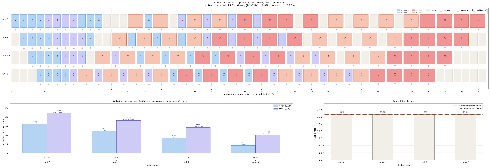

# VPP Pipeline Schedule Visualizer

 基于依赖驱动事件调度的流水线并行可视化工具:精确模拟 Megatron-LM 中 1F1B 和 VPP（Interleaved 1F1B）的调度行为。

## 功能特性

- **精确的依赖驱动调度**：基于事件拓扑依赖（而非硬编码时间线）分配全局时间步
- **B 占 2 倍时间**：反向传播的计算量（dw + dx）约是前向的 2 倍，在甘特图中正确体现
- **三阶段可视化**：
  - ▲ Warmup（上三角）：纯 forward，流水线灌满阶段
  - ◆ Steady（菱形）：1F1B 交替，稳定运转阶段
  - ▼ Cooldown（下三角）：纯 backward，流水线排空阶段
- **显存峰值分析**：按 BPipe 论文的 μ(s) 公式精确计算每个 rank 的激活值驻留数
- **Bubble rate 统计**：模拟实测 + 理论公式（近似式 & 严格式）对比
- **支持 GPipe / 1F1B / VPP 三种调度模式**

## 快速开始

```bash
# VPP 模式（默认）
python vpp_visualizer.py --pp 4 --vpp 2 --m 16 --num-layers 8 --output vpp_schedule.png

# 1F1B 对比
python vpp_visualizer.py --pp 4 --vpp 1 --m 16 --num-layers 8 --output f1b_schedule.png

# GPipe 模式
python vpp_visualizer.py --pp 4 --vpp 1 --m 8 --mode gpipe --output gpipe_schedule.png
```

## 参数说明

| 参数 | 类型 | 默认值 | 说明 |
|------|------|--------|------|
| `--pp` | int | 4 | 流水线并行度（P） |
| `--vpp` | int | 2 | 虚拟流水线并行度（V），设为 1 即标准 1F1B |
| `--m` | int | 16 | micro-batch 数量（M） |
| `--act-per-layer` | float | 1.0 | 每层每 micro-batch 的激活值大小（单位） |
| `--num-layers` | int | pp×vpp×2 | 模型总层数 |
| `--microbatch-group-size` | int | pp | N，默认等于 P |
| `--mode` | str | 1f1b | 调度模式：`1f1b` 或 `gpipe` |
| `--output` | str | vpp_schedule.png | 输出图片路径 |

## 输出示例
运行下面指令后会生成一张包含三部分的图：

```bash
python vpp_visualizer.py --pp 4 --vpp 2 --m 8 --num-layers 16 --output test.png
```
图示如下:




1. **上方：流水线调度甘特图**
   - 每个 rank 一行，横轴为全局时间步
   - 不同颜色区分 chunk 0 和 chunk 1
   - F 占 1 格宽，B 占 2 格宽
   - 正下方标记区分三阶段

2. **左下方：显存峰值对比**
   - 1F1B (V=1) vs VPP 的激活显存峰值
   - 标注 in-flight 数量和 BPipe μ(s) 值
   - 底部显示比值

3. **右下方：Per-rank bubble rate**
   - 每个 rank 的 bubble 占比
   - 模拟实测值 vs 理论公式对比

<details>
<summary>点击展开终端输出</summary>

```
配置: pp=4, vpp=2, m=8, N=4
总层数=16, 每device层数=4, 每chunk层数=2
F 持续时间=1, B 持续时间=2 (xF)

三阶段概要:
rank   phase        #events    time range           #F     #B    
-----------------------------------------------------------------
  0    warmup       10         [0, 9]         10     0     
  0    steady       12         [10, 31]         6      6     
  0    cooldown     10         [32, 56]         0      10    
  1    warmup       8          [1, 8]         8      0     
  1    steady       16         [9, 34]         8      8     
  1    cooldown     8          [36, 54]         0      8     
  2    warmup       6          [2, 7]         6      0     
  2    steady       20         [8, 38]         10     10    
  2    cooldown     6          [40, 52]         0      6     
  3    warmup       4          [3, 6]         4      0     
  3    steady       24         [7, 42]         12     12    
  3    cooldown     4          [43, 50]         0      4     

各 rank 时序 (max_time=56):
  rank 0: num_warmup=10, mu=11, events=32, max_t=56, bubble=15.8%
  rank 1: num_warmup=8, mu=9, events=32, max_t=54, bubble=15.8%
  rank 2: num_warmup=6, mu=7, events=32, max_t=52, bubble=15.8%
  rank 3: num_warmup=4, mu=5, events=32, max_t=50, bubble=15.8%

Bubble rate:
  实测 (模拟): 15.79%  (36/228 cells)
  理论 (P-1)/(V*M):       18.75%  (近似式, M>>P 时准)
  理论 (P-1)/(V*M + P-1): 15.79%  (严格式)
  实测 vs 严格式差距: 0.00%

显存峰值对比:
rank   num_warmup   mu (in-flight) peak(VPP)    peak(1F1B)   ratio   
  0    10           11             22.000       16.000       x1.375  
  1    8            9              18.000       12.000       x1.500  
  2    6            7              14.000       8.000        x1.750  
  3    4            5              10.000       4.000        x2.500  

已保存: test.png
```

</details>

## 核心公式

### Warmup 数量（Megatron 源码）

$$
\text{num warmup}(r) =
\begin{cases}
P - r - 1 & \text{(1F1B)} \\[6pt]
(P - r - 1) \times 2 + (V - 1) \times N & \text{(VPP)}
\end{cases}
$$

其中 $N = \text{microbatch group size per vp stage}$，默认 $N = P$。

### 在途激活值数量 $\mu(s)$（BPipe 论文，当 $N = P$ 时）

$$
\mu(s) = \text{num warmup}(s) + 1 = P \cdot (V - 1) + 2 \cdot (P - s - 1) + 1
$$

简化后：

$$
\mu(s) = P \cdot V + P - 1 - 2s
$$

相邻 stage 的 $\mu$ 差为 $2$（VPP）或 $1$（1F1B）。

| 调度方式 | $\mu(s)$ | 相邻差 |
|----------|----------|--------|
| 1F1B | $P - s$ | $1$ |
| VPP | $P \cdot V + P - 1 - 2s$ | $2$ |

### 激活值峰值

stage $s$ 的激活显存峰值由三部分相乘得到：

$$
\text{Peak}(s) = \mu(s) \times \frac{\text{layers per device}}{V} \times \text{act per layer}
$$

其中：
- $\mu(s)$：在途 micro-batch 数量
- $\text{layers per device} / V$：每个 chunk 的层数（VPP 将设备上的层均分到 $V$ 个 chunk）
- $\text{act per layer}$：每层每 micro-batch 的激活值大小

**1F1B（$V = 1$）的峰值：**

$$
\text{Peak}_{\text{1F1B}}(s) = (P - s) \times \text{layers per device} \times \text{act per layer}
$$

**VPP 的峰值：**

$$
\text{Peak}_{\text{VPP}}(s) = (P \cdot V + P - 1 - 2s) \times \frac{\text{layers per device}}{V} \times \text{act per layer}
$$

### 各 rank 的峰值比

**通用公式（任意 $P, V, N = P$）：**

$$
\frac{\text{Peak}_{\text{VPP}}(s)}{\text{Peak}_{\text{1F1B}}(s)} = \frac{P \cdot V + P - 1 - 2s}{V \times (P - s)}
$$

**各 rank 具体展开（$P = 4, V = 2$ 为例）：**

| rank $s$ | $\mu_{\text{VPP}}$ | $\mu_{\text{1F1B}}$ | 峰值比公式 | 数值 |
|----------|-------------------|---------------------|-----------|------|
| $0$ | $4 \times 2 + 4 - 1 - 0 = 11$ | $4$ | $\frac{11}{2 \times 4} = \frac{11}{8}$ | $\times 1.375$ |
| $1$ | $4 \times 2 + 4 - 1 - 2 = 9$ | $3$ | $\frac{9}{2 \times 3} = \frac{9}{6}$ | $\times 1.500$ |
| $2$ | $4 \times 2 + 4 - 1 - 4 = 7$ | $2$ | $\frac{7}{2 \times 2} = \frac{7}{4}$ | $\times 1.750$ |
| $3$ | $4 \times 2 + 4 - 1 - 6 = 5$ | $1$ | $\frac{5}{2 \times 1} = \frac{5}{2}$ | $\times 2.500$ |

**关键结论：**
- 系统瓶颈始终在 rank $0$，涨幅仅 $\frac{P \cdot V + P - 1}{V \cdot P}$
- rank 末段（$s = P-1$）虽然比值最大，但绝对值最小，不构成瓶颈
- 随着 $V$ 增大，rank $0$ 的峰值比趋近于 $2$（上界），而非 $V$ 倍

### Bubble Rate

$$
\text{Bubble}_{\text{approx}} = \frac{P - 1}{V \cdot M} \quad \text{（} M \gg P \text{ 时准确）}
$$

$$
\text{Bubble}_{\text{strict}} = \frac{P - 1}{V \cdot M + P - 1} \quad \text{（精确公式）}
$$
## 依赖规则

模拟器使用以下事件依赖规则进行全局时间调度：

```
F(r, mb, c)   依赖  F(r-1, mb, c)           (r > 0)
F(0, mb, c)   依赖  F(P-1, mb, c-1)         (c > 0)
B(r, mb, c)   依赖  B(r+1, mb, c)           (r < P-1)
B(P-1, mb, c) 依赖  B(0, mb, c+1)           (c < V-1)
B(P-1, mb, V-1) 依赖  F(P-1, mb, V-1)
```

## 参考资料

- [Megatron-LM: Efficient Large-Scale Language Model Training on GPU Clusters](https://arxiv.org/abs/2104.04473) (Narayanan et al., SC'21)
- [BPipe: Memory-Balanced Pipeline Parallelism](https://arxiv.org/abs/2306.08525) (Kim et al., ICML 2023)
- [Megatron-LM 源码](https://github.com/NVIDIA/Megatron-LM)

## License

MIT
```